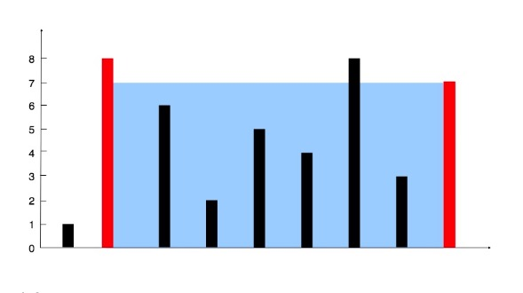

## 题目
给定 n 个非负整数 a1，a2，...，an，每个数代表坐标中的一个点 (i, ai) 。在坐标内画 n 条垂直线，垂直线 i 的两个端点分别为 (i, ai) 和 (i, 0)。找出其中的两条线，使得它们与 x 轴共同构成的容器可以容纳最多的水。



## 示例:


```
输入: [1,8,6,2,5,4,8,3,7]
输出: 49
```

## 暴力法解答
```
func max(i, j int) int {
    if i > j {
        return i
    } else {
        return j
    }
}  

func min(i, j int) int {
    if i > j {
        return j
    } else {
        return i
    }
}  

func maxArea(height []int) int {
    l := len(height)
    maxArea := 0
 
    for i := 0; i < l; i++ {        
        for j := i + 1; j < l; j++ {
            newArea := (j - i) * min(height[i], height[j])
            maxArea = max(maxArea, newArea)
        }   
    }   
    return maxArea
}

```
时间复杂度 `$O(n^2)$`  
空间复杂度 `$O(1)$`


## 双指针法解答
这种方法背后的思路在于，两线段之间形成的区域总是会受到其中较短那条长度的限制。此外，两线段距离越远，得到的面积就越大。

我们在由线段长度构成的数组中使用两个指针，一个放在开始，一个置于末尾。 此外，我们会使用变量 `$maxare$`来持续存储到目前为止所获得的最大面积。 在每一步中，我们会找出指针所指向的两条线段形成的区域，更新`$maxare$`，并将指向较短线段的指针向较长线段那端移动一步。

### Goalng 版本
```
// 双指针法
func maxArea(height []int) int {
    i := 0
    j := len(height) - 1
    maxArea := 0
    for i < j {
        newArea := (j - i) * min(height[i], height[j])
        maxArea = max(maxArea, newArea)
        if height[i] < height[j] {
            i++
        } else {
            j--
        }
    }
    return maxArea
}   
```

### Java 版本
```$xslt
    public int maxArea(int[] height) {
        int i = 0;
        int j = height.length - 1;

        int maxArea = 0;

        while (i < j) {
            int newArea = (j - i) * (height[i] < height[j] ? height[i] : height[j]);
            maxArea = maxArea > newArea ? maxArea : newArea;

            if (height[i] < height[j]) {
                i++;
            } else {
                j--;
            }
        }

        return maxArea;

    }
```
最初我们考虑由最外围两条线段构成的区域。现在，为了使面积最大化，我们需要考虑更长的两条线段之间的区域。如果我们试图将指向较长线段的指针向内侧移动，矩形区域的面积将受限于较短的线段而不会获得任何增加。但是，在同样的条件下，移动指向较短线段的指针尽管造成了矩形宽度的减小，但却可能会有助于面积的增大。因为移动较短线段的指针会得到一条相对较长的线段，这可以克服由宽度减小而引起的面积减小。

时间复杂度 `$O(n)$`  
空间复杂度 `$O(1)$`

